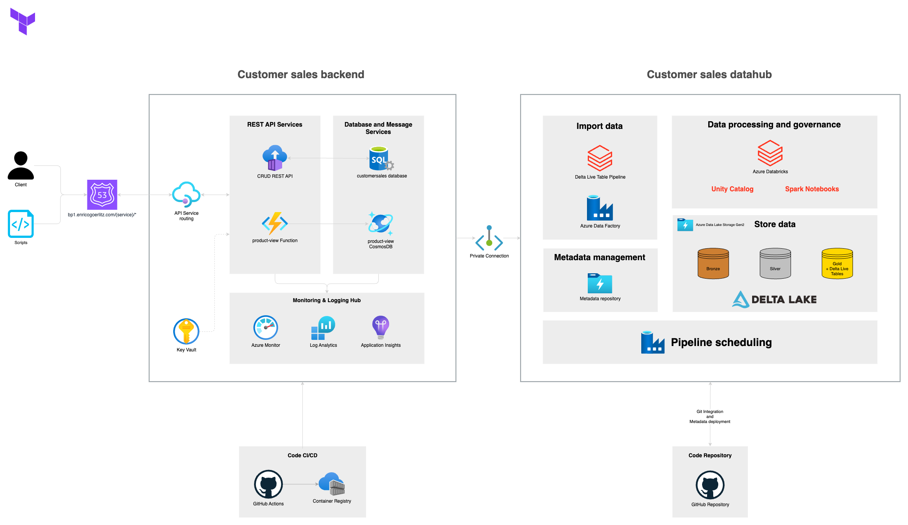
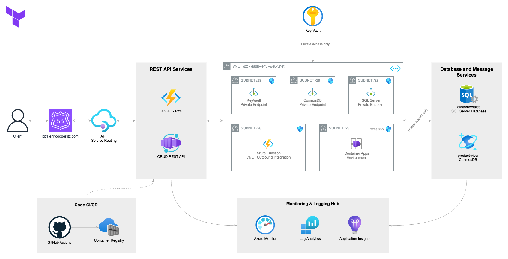
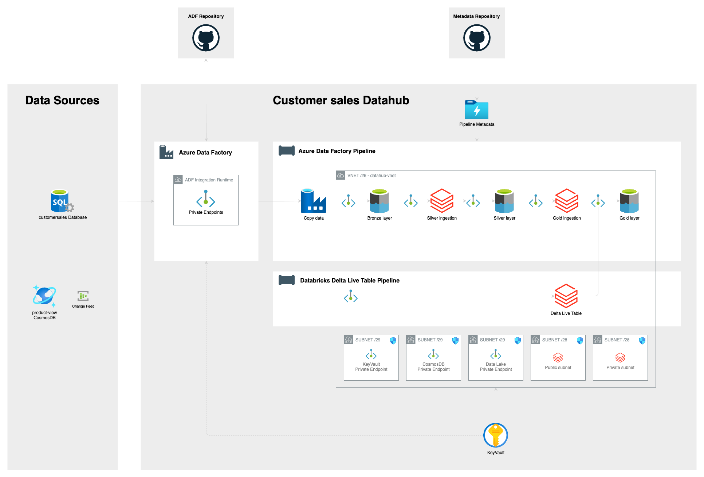
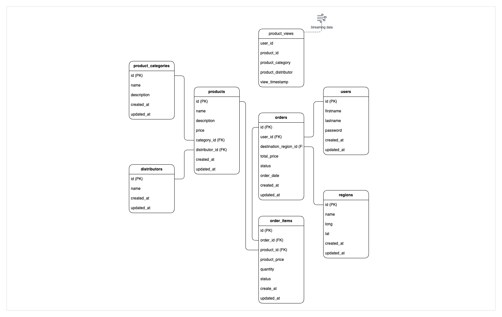

# 🎓 Project: explore-azure-databricks

## Project Architecture

### High Level Project Overview

### CustomerSales Backend Architecture

### CustomerSales Datahub Architecture

### CustomerSales Data model

